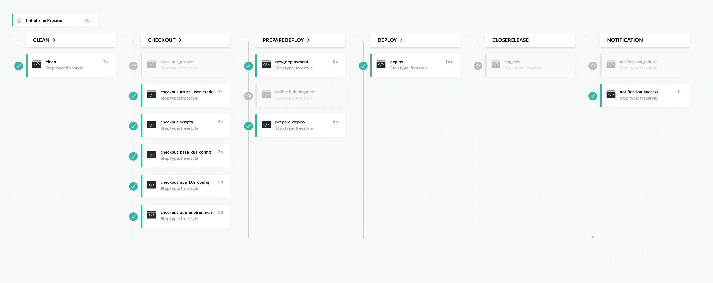

```yaml
version: '1.0'
```
#### Listando todas as etapas
```yaml
stages:
  - Clean
  - Checkout
  - PrepareDeploy
  - Deploy
  - CloseRelease
  - Notification
```
```yaml
steps:
```
#### Atribuindo imagem e limpando referências usadas anteriormente 
```yaml
  clean:
    fail_fast: false
    stage: Clean
    image: alpine:latest
    commands:
      - rm -rf ${{app_name}}
      - rm -rf scripts
      - rm -rf base_k8s_config
      - rm -rf app_k8s_config
      - rm -rf app_environment_config
      - rm -rf azure_credentials
```
#### Obtendo a aplicação do repositório
```yaml
  checkout_project:
    fail_fast: false
    stage: Checkout
    image: alpine/git:1.0.7
    commands:
      - git clone https://oauth2:${{gitlab_codefresh_token}}@${{repo_app}} ${{app_name}} --branch ${{CF_BRANCH}}
    when:
      condition:
        all:
          isToCheckoutProject: "steps.clean.result == 'success' && '${{environment}}' == 'prd'"
```
#### Obtendo credenciais da Azure
```yaml
  checkout_azure_user_credentials:
      fail_fast: false
      stage: Checkout
      image: alpine/git:1.0.7
      commands:
        - git clone https://oauth2:${{gitlab_codefresh_token}}@${{azure_user_credentials}} azure_credentials
        - apk update && apk add jq
        - cd azure_credentials/azure_credentials
        - cf_export azure_user=`jq '.user' codefresh.json`
        - cf_export azure_pass=`jq '.pass' codefresh.json`
        - cf_export azure_tenant=`jq '.tenant' codefresh.json`
      when:
        steps:
          - name: clean
            on:
              - success
          - name: checkout_project
            on:
              - success
              - skipped  
```
#### Obtendo [scripts](https://gitlab.ipirangacloud.com/devops/scripts/scripts-codefresh) no repositório para uso de funções durante as etapas da pipeline, as funcoes contidas nesse repositórios são:
- *Notification*
- *Disparo de outra pipeline*
- *Health check do serviço*
- *Sonar*

```yaml
  checkout_scripts:
    fail_fast: false
    stage: Checkout
    image: alpine/git:1.0.7
    commands:
      - git clone https://oauth2:${{gitlab_codefresh_token}}@${{repo_scripts_pipeline}} scripts
    when:
      steps:
        - name: clean
          on:
            - success
        - name: checkout_project
          on:
            - success
            - skipped
        - name: checkout_azure_user_credentials
          on:
            - success
```
### Obtendo pasta contendo arquivo base para o deploy da aplicação no Kubernate
```yaml
  checkout_base_k8s_config:
    fail_fast: false
    stage: Checkout
    image: alpine/git:1.0.7
    commands:
      - git clone https://oauth2:${{gitlab_codefresh_token}}@${{repo_base_config_kubernetes}} base_k8s_config
    when:
      steps:
        - name: checkout_scripts
          on:
            - success
        - name: checkout_azure_user_credentials
          on:
            - success
```

```yaml
  checkout_app_k8s_config:
    fail_fast: false
    stage: Checkout
    image: alpine/git:1.0.7
    commands:
      - git clone https://oauth2:${{gitlab_codefresh_token}}@${{repo_app_config_kubernetes}} app_k8s_config
    when:
      steps:
        - name: checkout_base_k8s_config
          on:
            - success
```

#### Obtendo pasta contendo arquivo de configuração para uso na aplicação
**Obs:** *Etapa de uso especifico da Aplicação*
```yaml
  checkout_app_environment_config:
    fail_fast: false
    stage: Checkout
    image: alpine/git:1.0.7
    commands:
      - git clone https://oauth2:${{gitlab_codefresh_token}}@${{repo_app_enviroment_config}} app_environment_config
    when:
      steps:
        - name: checkout_base_k8s_config
          on:
            - success
```
#### Atribuindo tag do commit em uma variável se as estapas anteriores tiverem avançado com sucesso
```yaml
  new_deployment:
    fail_fast: false
    stage: PrepareDeploy
    image: alpine:latest
    commands:
      - cf_export VERSION_DEPLOYMENT=${{CF_SHORT_REVISION}}
    when:
      condition:
        all:
          isExecuteNewDeployment: "steps.checkout_app_k8s_config.result == 'success' && steps.checkout_app_environment_config.result == 'success' && ${{rollback}} == false"
```
#### Atribuindo versao do rollback em uma variável se as estapas anteriores tiverem avançado com sucesso
```yaml
  rollback_deployment:
    fail_fast: false
    stage: PrepareDeploy
    image: alpine:latest
    commands:
      - cf_export VERSION_DEPLOYMENT=${{rollback_version}}
    when:
      condition:
        all:
          isExecuteNewDeployment: "steps.checkout_app_k8s_config.result == 'success' && steps.checkout_app_environment_config.result == 'success' && ${{rollback}} == true"
```
#### Nos arquivos contido no repositório carregado nas etapas anteriores, os dados sao substituidos para o contexto necessário.
```yaml
  prepare_deploy:
    fail_fast: false
    stage: PrepareDeploy
    image: alpine:latest
    commands: 
      - sed -i -e 's/${project_name}/${{project_name}}/g' base_k8s_config/back-end/namespace.yml
      - sed -i -e 's/${environment}/${{environment}}/g' base_k8s_config/back-end/namespace.yml
      - sed -i -e 's/${app_name}/${{app_name}}/g' base_k8s_config/back-end/deployment.yml
      - sed -i -e 's/${app_version}/${{VERSION_DEPLOYMENT}}/g' base_k8s_config/back-end/deployment.yml
      - sed -i -e 's/${app_port}/${{app_port}}/g' base_k8s_config/back-end/deployment.yml
      - sed -i -e 's/${environment}/${{environment}}/g' base_k8s_config/back-end/deployment.yml
      - sed -i -e 's/${memory}/${{memory}}/g' base_k8s_config/back-end/deployment.yml
      - sed -i -e 's/${cpu}/${{cpu}}/g' base_k8s_config/back-end/deployment.yml
      - sed -i -e 's/${url_health_check}/${{url_health_check}}/g' base_k8s_config/back-end/deployment.yml
      - sed -i -e 's/${replicas}/${{replicas}}/g' base_k8s_config/back-end/deployment.yml
      - sed -i -e 's/${project_name}/${{project_name}}/g' base_k8s_config/back-end/deployment.yml
      - sed -i -e 's/${registry_domain}/${{registry_domain}}/g' base_k8s_config/back-end/deployment.yml
      - sed -i -e 's/${app_name}/${{app_name}}/g' base_k8s_config/back-end/service.yml
      - sed -i -e 's/${app_port}/${{app_port}}/g' base_k8s_config/back-end/service.yml
      - sed -i -e 's/${environment}/${{environment}}/g' base_k8s_config/back-end/service.yml
      - sed -i -e 's/${project_name}/${{project_name}}/g' base_k8s_config/back-end/service.yml
      - sed -i -e 's/${app_name}/${{app_name}}/g' app_k8s_config/configmap-${{environment}}.yml
      - sed -i -e 's/${environment}/${{environment}}/g' app_k8s_config/configmap-${{environment}}.yml
      - sed -i -e 's/${project_name}/${{project_name}}/g' app_k8s_config/configmap-${{environment}}.yml
      - sed -i -e 's/${app_name}/${{app_name}}/g' base_k8s_config/back-end/ingress.yml
      - sed -i -e 's/${environment}/${{environment}}/g' base_k8s_config/back-end/ingress.yml
      - sed -i -e 's/${app_port}/${{app_port}}/g' base_k8s_config/back-end/ingress.yml
      - sed -i -e 's/${app_path}/${{app_path}}/g' base_k8s_config/back-end/ingress.yml
      - sed -i -e 's/${project_name}/${{project_name}}/g' base_k8s_config/back-end/ingress.yml
      - sed -i -e 's/${whitelist_ips}/${{whitelist_ips}}/g' base_k8s_config/back-end/ingress.yml
      - sed -i -e 's/${project_name}/${{project_name}}/g' base_k8s_config/back-end/ingress.yml
      - sed -i -e 's/${app_name}/${{app_name}}/g' base_k8s_config/back-end/hpa.yml
      - sed -i -e 's/${environment}/${{environment}}/g' base_k8s_config/back-end/hpa.yml
      - sed -i -e 's/${project_name}/${{project_name}}/g' base_k8s_config/back-end/hpa.yml
      - sed -i -e 's/${maxReplicas}/${{maxReplicas}}/g' base_k8s_config/back-end/hpa.yml
      - sed -i -e 's/${minReplicas}/${{minReplicas}}/g' base_k8s_config/back-end/hpa.yml
      - cat base_k8s_config/back-end/namespace.yml
      - cat base_k8s_config/back-end/deployment.yml
      - cat base_k8s_config/back-end/service.yml
      - cat app_k8s_config/configmap-${{environment}}.yml
      - cat base_k8s_config/back-end/ingress.yml
      - cat base_k8s_config/back-end/hpa.yml
    when:
      steps:
        any:
          - name: new_deployment
            on:
              - success
          - name: rollback_deployment
            on:
              - success
```
#### Nessa etapa é feito o login na Azure, instalação da dependências necessárias e feito deploy da aplicação para o cluster do Kubernete
```yaml
  deploy:
    fail_fast: false
    stage: Deploy
    image: mcr.microsoft.com/azure-cli:latest
    commands:
      - az login --service-principal -u ${{azure_user}} -p ${{azure_pass}} --tenant ${{azure_tenant}}
      - az aks install-cli
      - az account set -s ${{subscription}}
      - az aks get-credentials --resource-group ${{resource_group}} --name ${{cluster_name}}
      - export KUBECONFIG=$KUBECONFIG:$HOME/.kube/config
      - kubectl apply --force -f base_k8s_config/back-end/namespace.yml
      - kubectl apply --force -f app_k8s_config/configmap-${{environment}}.yml
      - kubectl apply --force -f base_k8s_config/back-end/deployment.yml
      - kubectl apply --force -f base_k8s_config/back-end/service.yml
      - kubectl apply --force -f base_k8s_config/back-end/ingress.yml
      - kubectl apply --force -f base_k8s_config/back-end/hpa.yml
    env:
      name: ${{project_name}}-${{environment}}
      endpoints:
        - name: ${{project_name}}-${{environment}}
      type: kubernetes
      change: ${{CF_COMMIT_MESSAGE}}
      filters:
        - cluster: ${{context}}
          namespace: ${{project_name}}-${{environment}}
    when:
      steps:
        - name: prepare_deploy
          on:
            - success
```

```yaml
  tag_scm:
    fail_fast: false
    stage: CloseRelease
    image: alpine/git:1.0.7
    commands:
      - cd ${{app_name}}
      - git config --global user.email "ipirangaatq@gmail.com"
      - git config --global user.name "Codefresh_DevOps"
      - git tag -a ${{CF_SHORT_REVISION}} -m "Versão de produção fechada."
      - git push origin --tags
    when:
      condition:
        all:
          isExecuteTagScm: "steps.deploy.result == 'success' && ${{rollback}} == false && '${{environment}}' == 'prd'"
```
#### Faz a checagem se alguma  etapa falhou, em caso positivo executa os scripts carregados nos passos anteriores e dispara uma notificação por email sobre o falha no processo
```yaml
  notification_failure:
    stage: Notification
    image: python:3.9.0a3-alpine3.10
    commands:
      - pip3 install requests
      - pip3 install sendgrid
      - python3 scripts/notification/deploy/notification_failure.py "${{codefresh_api_token}}" "${{CF_REVISION}}" "${{app_name}}" "${{environment}}" "${{CF_COMMIT_MESSAGE}}" "${{emails}}"
      - exit 1
    when:
      steps:
        any:
          - name: clean
            on:
              - failure
          - name: checkout_project
            on:
              - failure
          - name: checkout_scripts
            on:
              - failure
          - name: checkout_base_k8s_config
            on:
              - failure
          - name: checkout_app_k8s_config
            on:
              - failure
          - name: new_deployment
            on:
              - failure
          - name: rollback_deployment
            on:
              - failure
          - name: prepare_deploy
            on:
              - failure
          - name: deploy
            on:
              - failure
          - name: tag_scm
            on:
              - failure
          - name: notification_success
            on:
              - failure
```
#### Faz a checagem se todas as etapas tiveram sucesso, em caso positivo executa os scripts carregados nos passos anterioes e dispara uma notificação por email sobre o sucesso do processo
```yaml
  notification_success:
    stage: Notification
    image: python:3.9.0a3-alpine3.10
    commands:
      - pip3 install sendgrid
      - python3 scripts/notification/deploy/notification_success.py "${{app_name}}" "${{environment}}" "${{CF_REVISION}}" "${{CF_COMMIT_MESSAGE}}" "${{emails}}"
    when:
      steps:
        all:
          - name: clean
            on:
              - success
          - name: checkout_project
            on:
              - success
              - skipped
          - name: checkout_scripts
            on:
              - success
          - name: checkout_base_k8s_config
            on:
              - success
          - name: checkout_app_k8s_config
            on:
              - success
          - name: new_deployment
            on:
              - success
              - skipped
          - name: rollback_deployment
            on:
              - success
              - skipped
          - name: prepare_deploy
            on:
              - success
          - name: deploy
            on:
              - success
          - name: tag_scm
            on:
              - success
              - skipped
```
